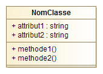
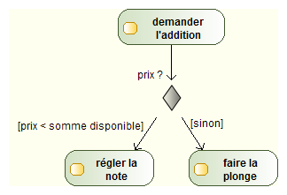

% Analyse informatique
% Division des enseignements en informatique
% janvier 2017


# Introduction #

##  ##
</br>


## Motivations ##

* Pas d'usure des logiciels
* Erreurs humaines uniquement
* Obsolescence d'un logiciel causée par
	* des logiciels plus performants
	* de nouveaux usages


## Quelques chiffres ##
</br>

* Coût d'un logiciel :
	* maintenance = 53%
	* correction bogues = 17%


## Quelques chiffres ##
</br>


## Le besoin ##
</br>

* Outils d'aide à la modélisation pour :
	* élaborer la structure des programmes
	* s'assurer que les exigences initiales ont bien été respectées
	* maintenir les logiciels


## Le programme ##
</br>

1. Programmation orientée objet
2. Présentation d'UML
3. Etude de plusieurs diagrammes UML
4. Cycles de développement


## Organisation ##
</br>

* 4 séances de 3h

</br>

* projet à faire à la maison


# Programmation orientée objet #

## Paradigmes de programmation ##

* Plusieurs *manière* de programmer
	* programmation impérative : suite d'instructions
	* programmation fonctionnelle : composition de fonctions
	* programmation orientée objet : définition d'interactions entre structures d'objets
	* ...
	
```
1- faire fondre le beurre
2- lorsque le beurre est fondu ajouter le chocolat
3- ajouter les oeufs
```


## Programmation fonctionnelle ##

* Apparition dans les années 1960
* Programme découpé en fonctions, elles-mêmes découpées en sous-fonctions...
* Approche *descendante*


## Exemple ##
</br>


## Limites de la programmation fonctionnelle ##


## Limites de la programmation fonctionnelle ##


## Programmation orientée objet ##

* Développement dans les années 1980
* Décrit les structures de base du système et leurs interactions
* Approche *ascendante*


## Exemple ##
</br>


## Fonctionnel vs. Orienté objet ##
</br>

* Approche fonctionnelle plus intuitive
* Approche objet facilement réutilisable et maintenable
* Résolvent les mêmes problèmes


## Concepts de l'orienté objet - l'objet ##

> **Objet** : entité autonome, aux frontières précises, décrit par une collection de propriétés et de traitements associés

* Un objet possède une identité, un nom
* Un ensemble d'**attributs** caractérisent l'état de l'objet
* Un ensemble d'**opérations** en définit le comportement


## Exemples d'objets ##
</br>


## Concepts de l'orienté objet - la classe ##

> **Classe** : type abstrait de donnée destiné à décrire une structure d'objets, caractérisé par des attributs et des méthodes

* Objet créé selon le modèle d'une classe
	* Objet = **instance** de classe


## Exemples de classes ##
</br>

* Point
* Bouton
* Personne


## Concepts de l'orienté objet - l'encapsulation ##

> **Encapsulation** : concept qui consiste à masquer les détails de l'implémentation d'un objet à son utilisateur

* Partie visible de l'objet appelée **interface**
* Garantie l’intégrité des données
* Principe facilitant l’évolution des applications


## Exemple d'encapsulation ##
</br>


## Exemple d'encapsulation ##
</br>


## Concepts de l'orienté objet - l'héritage ##

> **Héritage** : principe autorisant le création d'une classe dérivée à partir d'une classe existante

* Attributs et méthodes de la classe existante transmis à la classe dérivée
* Classe *mère* / classe *fille*
* Principe encourageant la réutilisation


## Exemple d'héritage ##


## Concepts de l'orienté objet - le polymorphisme ##

> **Polymorphisme** : faculté de pouvoir redéfinir dans une classe dérivée les méthodes héritées de la classe parente

* Permet une programmation plus générique
* Dans le cas de l’héritage : spécifier un comportement général


## Exemple de polymorphisme ##
</br>


## Modélisation orienté objet ##

* En résumé, l'approche objet c'est :
	* objets, classes, encapsulation, héritage, polymorphisme
	* des facilités pour faire évoluer les programmes
* Mais :
	* pas toujours très intuitif
	* quelle représentation pour ces structures/concepts ?


# Présentation d'UML #

## Naissance d'un langage de modélisation ##
</br>


## Naissance d'un langage de modélisation ##
</br>


## Généralités ##


* Langage graphique de conception orienté objet
* Couvre l'intégralité des systèmes informatiques
	* utilisation, conception, déploiement
* Compréhensible par l'homme et par la machine
* Standard largement adopté par l'industrie


## Les diagrammes UML ##
</br>


## Les diagrammes UML ##
</br>

* 14 diagrammes en version 2.5
	* 7 diagrammes struturels : composants du système et fonctionnalités permises
	* 7 diagrammes comportementaux : intéractions entre les éléments d'un système

</br>


## UML ##
</br>

* En résumé, UML c'est :
	* un langage graphique de conception orientée objet
	* contitué de diagrammes accompagnés d'explications
	* pas une méthode


# Le diagramme de cas d'utilisation #

## Le diagramme de cas d'utilisation ##

* **Structurer le besoin de l'utilisateur**
	* Représentation des attentes de l'utilisateur
	* Définition du périmètre de l'application (=*frontière*)


## Le cas d'utilisation ##

* Action (=> verbe à l'infinif)


* Structuration possible en sous-cas d'utilisation
	* inclusion = obligatoire
	* extension = optionnel


## Les acteurs ##

* Personne ou système en interaction avec le système
* Identifié
* 2 catégories :
	* acteur principal : exprime une attente vis à vis du système
	* acteur secondaire : est sollicité par le système


## Les acteurs ##
</br>


## Liens entre acteurs ##

* La généralisation


## Exemple ##


## Description textuelle ##

* Nécessaire pour 
	* Détailler un cas d'utilisation (entrées/sorties...)
	* Préciser une chronologie
* Comprend
	* Identification : nom, objectif, acteurs, dates, responsable
	* Description : pré-condition, scénario, post-conditions
	* Spécifications non fonctionnelles


## Exercices ##

1. 
1.
1.


# Le diagramme de classes #

## Diagramme de classes ##

* **Représenter les structures de données**
	* classes et liens entre classes...
	* mise en oeuvre des concepts de l'orienté objet
	* modélisation statique


## Elements de bases ##

* La classe = structure de données abstraite
	* nom (au singulier)
	* attributs
	* méthodes
	


* L'association


## Les attributs ##

* Visibilité : public (`+`), privé (`-`), protégé (`#`)
* Type : `integer`, `float`, `string`, `date`, `boolean`, ...
* Multiplicité : `[2]`, `[3]`, `[*]`...
* Valeur par défaut : `=valeur_par_defaut`
* Attribut dérivé = 

``` 
{-, #, +} nom_attribut : type_attribut {[multiplicite]} {=valeur_par_defaut}
```

## Les attributs dérivés ##

* Dont la valeur dépend des autres attributs
	* pas d'affectation

</br>
	


## Les méthodes ##

* Signature d'une méthode

```
{-, #, +} nom_methode ({nom_param1: type_param1, nom_param_2: type_param2, ...}) {: type_retour}
```


## Les associations ##

* Types d'associations
	* association (*simple*)
	* héritage
	* agrégation
	* composition
* Cardinalité : 
	* `0..1`
	* `1`
	* `*`
	* `1..*`
	* `M..N`
	* `N`


## L'association simple ##


</br>


## L'héritage ##

* Concept orienté objet du même nom
* Attributs et méthodes automatiquement transmis à la classe fille

</br>


## Exemples d'héritage ##
</br>


## Agrégation-composition ##

* Composition  = *agrégation forte*

</br>


## Les classes associations ##

* Classe avec des informations sur une association

<br/>


## Les classes abstraites ##

* Classe qui ne peut être instanciée

</br>


## Exercice ##

1.
1.
1.


# Le diagramme d'objets #

## Le diagramme d'objets ##

* **Représenter les objets du système à un instant donné**
	* illustrer le diagramme de classe
	* détailler un aspect particulier
	


## Les objets ##

* Objet = instance de classe
	* Nom de l'objet souligné : `nom_objet:NomClasse`
	* Attributs avec une valeur : `attribut: type = valeur`
	* Méthodes non représentées


## Les liens ##

* Lien = instance d'association
	* Liens simples uniquement
	* Pas d'héritage
	* Cardinalité de `1` toujours
	* Nom du lien souligné


## Exemple ##


</br>


## Exemple ##


## Exercices ##

1. 


# Le diagramme de paquetage #

## Le diagramme de paquetage ##

* **Représenter l'organisation en paquetages**
	* paquetage = ensemble d'éléments UML fournissant un service cohérent
	* utile pour structurer les gros projets

</br>


## Dépendances entre paquetages ##
</br>


</br>


## Exemple ##
</br>


## Exemple ##
</br>


# Le diagramme de déploiement #

## Diagramme de déploiement ##

* **Décrire la configuration physique des matériels**
	* répartition des composants
	* interractions entre noeuds

</br>


## Noeuds et composants ##

* Noeud = élément physique du système
* Composant = unité logicielle autonome
	* *diagramme de composant : vue de haut niveau sur un système*
* Artifact = fichier présent sur un noeud et matérialisant la présence d'un composant


## Exercice ##

1. Station météo


# Le diagramme d'activité #

## Diagramme d'activité ##

* **Décrire les enchaînements d'actions lors d'une fonctionnalité importante**
	* un cas d'utilisation
	* une méthode importante


## Eléments de base ##
</br>


</br>


</br>


## Branchement conditionnel ##

* Activités dépendantes du résultat d'un test

<br/>




## Transitions concurrentes ##

* Activités effectuées en parallèle
* **Join** = séparation de branches d'activités
* **Fork** = resynchronisation des branches d'activités

</br>


## Exemple ##


## Exemple ##


## Couloir d'activités ##


## Exercice ##

1. Mousse au chocolat
2. GPS de navigation


# Le diagramme de séquence #

## Diagramme de séquence ##

* **Décrire les interactions entre entités lors d'une fonctionnalité importante**
	* un cas d'utilisation
	* une méthode importante


## Activation des objets ##

* Axe du temps du haut vers le bas
* Ligne de vie des objets
	* périodes d'activation
	


## Echanges de messages ##

* Flux de données échangés
	* envoi d'un message =appel de méthode
	* réponse =retour de méthodes
	* numérotation optionnelle des messages échangés
* Types de messages :
	* synchrone : attente d'une réponse
	* asynchrone : pas de réponse/retour
	* de retour : valeur renvoyée suite à message synchrone
	* création / destruction
	
## Types de messages ##


	
## Cadre d'interaction ##

* Partie du diagramme associée à une modalité d'exécution
	* `opt` : condition de test (*si* en programmation)
	* `alt` : plusieurs conditions de test (*si / sinon si...*)
	* `loop` : répétition d'un échange de messages
	* `par` : fragments exécutés en parallèle
	* `ref` : passage par un autre diagramme de séquence


## Exemple ##


## Exercice ##

1. Correspondance diagramme de classes / diagramme de séquence


# Le diagramme d'états-transitions #

## Diagramme d'états-transitions ##

* **Représenter les états possibles d'un objet et les transitions entre eux**
	* utile lorsque l'état d'un objet dépend de son hitorique
	* symbolique proche de celle du diagramme d'activité


## Etats et transitions ##

* Etat stable
* Transition instantannée


## Conditions de garde ##

* Plusieurs transtions possibles à partir d'un état


## Transitions refléxives ##

* Transition laissant l'objet dans le même état


## Exercice ##

1. Démineur


# UML et méthodologie #

##  ##

* UML est un langage


## Du besoin au code ##


## Qualité d'un logiciel ##

* Capacité fonctionnelle
	* réponse aux besoins explicites et implicites
* Facilité d'utilisation
	* ergonomie, gestion des utilisations incorrectes
* Fiabilité
	* exactitude des résultats, tolérance aux pannes
* Performance
	* temps de réponse, débit
* Maintenabilité
	* effort nécessaire pour corriger ou transformer
* Portabilité
	* aptitude à fonctionner dans un nouvel environnement
	

## Cycles de développement ##


## Cycles de développement ##


## Méthodes de développement ##

* Quelques méthodes de développement utilisant UML :
	* Le processus unifié (PU, UP, RUP, AUP...)
	* La méthode minimale
	* La méthode *extreme programming* (XP)


## Le processus unifié ##

* Basé sur UML
* Guidé par les besoins des utilisateurs
* Centré sur l'architecture logicielle
* Itératif et incrémental


## Le processus unifié ##

* Guidé par les besoins des utilisateurs
	* modèles UML dérivés des cas d'utilisation 
* Marche à suivre :
	1. réaliser un ébauche grossière de l'application
	2. identifier les fonctions essentielles
	3. adapter l'architecture pour prendre en compte ces fonctionnalités
	4. tester
	5. recommencer
* *S'y prendre en plusieurs fois et affiner le modèle par étapes*

## Le processus unifié ##


## eXtreme Programming ##

* Client maîtrise d'ouvrage
* Livraisons au plus tôt
* Tests de toutes les fonctionnalités
* Amélioration continue de la structure interne


## eXtreme Programming ##

* Programmation
	* développement guidés par les tests
	* conception simple
	* remaniement
* Collaboration
	* programmation en binôme
	* responsabilité collective du code
	* règles de codage
	* intégration continue
* Gestion de projet
	* Client sur site
	* Rythme durable
	* Livraisons fréquentes
	* Planification itérative


## Appartée sur les tests ##

* Tests unitaires
	* écrits éventuellement avant le code
	* guider et rythmer la conception
	* documenter le code
* Tests fonctionnels
	* absence d'anomalie
	* fonctionnalités livrées
	* = recette
	


